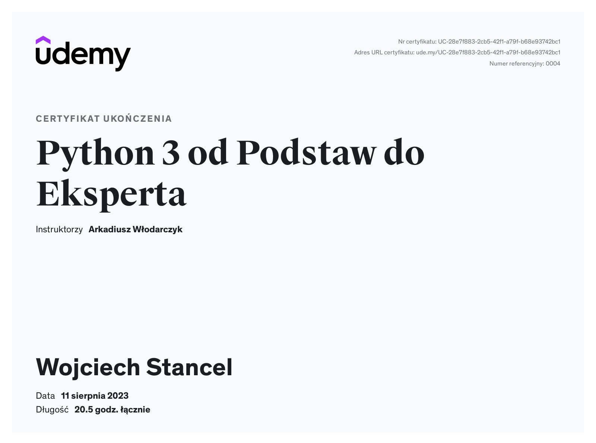
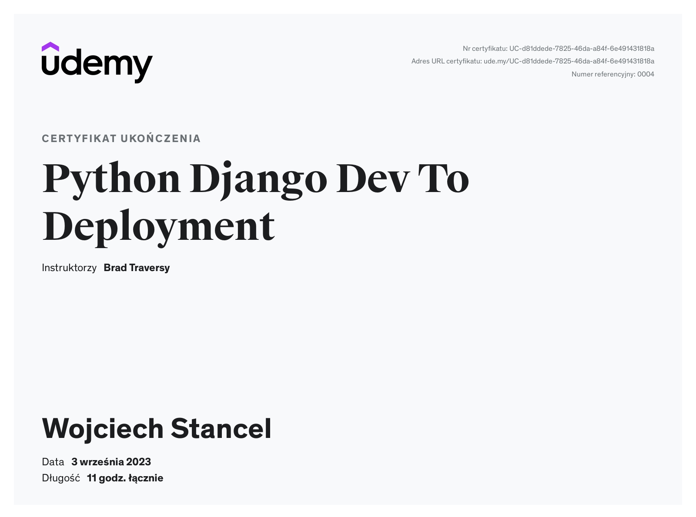

My Certificates 🧑‍🎓
=== 
**Certificate that I have received after the Orange Foundation Coding School - 6 months of learning. **
  - [Wojciech_Stancel_Python_Certificate.pdf](Wojciech_Stancel_Python_Certificate.pdf)

---
**Certificates I have obtained after learning on my own. I spend many hours every day improving my skills and knowledge. I get very excited when I can learn new things 🧠**
1. **Python & Django Rest API **
   

2. **Python 3: From Basic to Expert **
   

3. **Python Django: Development to Deployment  **
   

Thank you for your interest in my achievements! 🙏

---

> My Website 💻 [CodeCr8ive.pl](https://www.codecr8ive.pl) &nbsp;&middot;&nbsp;
> My account on
[Github ](https://github.com/WojciechStancel) &nbsp;&middot;&nbsp;
> Find me on
 [Linkedin ](https://www.linkedin.com/in/wojciech-stancel/) 
